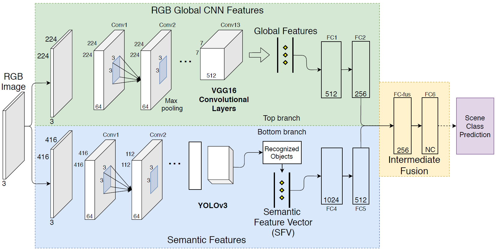
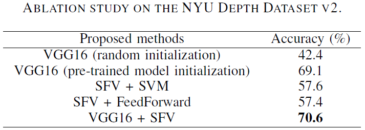
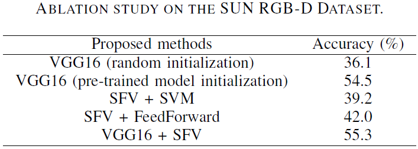
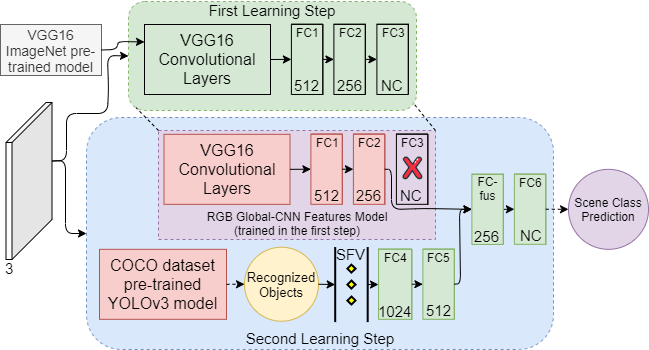

# GSF2App
Implementation of the Global and Semantic Feature Fusion Approach ([GSF2App](https://ieeexplore.ieee.org/abstract/document/9096068)) for Indoor Scene Classification using the PyTorch framework.

<p align="center"></p>

## Performing
GSF2App was evaluated on the [NYU V2](https://cs.nyu.edu/~silberman/datasets/nyu_depth_v2.html) and [SUN RGB-D](https://rgbd.cs.princeton.edu) datasets.

<p align="center">  
  
### Requirements

    Python >= 3.6
    PyTorch >= 1.0.1
    torchvision
    cv2
    tqmd
    
### Training & Tracking
Global and Semantic features are combined in a two-step learning.
<p align="center"></p>


To train:

    $ [Comming Soon]

To Evaluate:

    $ [Comming Soon]

## Citation

```
@InProceedings{gsf2app_2020,
  author={R. {Pereira} and N. {Gonçalves} and L. {Garrote} and T. {Barros} and A. {Lopes} and U. J. {Nunes}},
  booktitle={IEEE International Conference on Autonomous Robot Systems and Competitions (ICARSC)}, 
  title={{Deep-Learning based Global and Semantic Feature Fusion for Indoor Scene Classification}}, 
  year={2020}}
```


## Contacts
ricardo.pereira@isr.uc.pt
