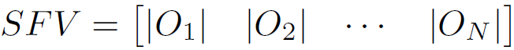
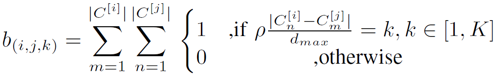

# GSF2AppV2
Implementation of the Global and Semantic Feature Fusion Approach enhanced with Inter-Object Distance Semantic Features (GSF2AppV2) for Indoor Scene Classification using the PyTorch framework.
Global features were extracted by one of the mencioned state-of-the-art CNN. Semantic features are composed by the number of object occurrences recognized in the image per object class (SFV), and by inter-object distance relationships in an histogram-like approach (SFM).

<p align="center"></p>

<p align="center">   

## Performing
GSF2App was evaluated on the [NYU V2](https://cs.nyu.edu/~silberman/datasets/nyu_depth_v2.html) and [SUN RGB-D](https://rgbd.cs.princeton.edu) datasets.

  
### Requirements

    Python >= 3.6
    PyTorch >= 1.0.1
    torchvision
    cv2
    tqmd
    
### Training & Evaluate
Global and Semantic features are combined in a two-step learning. Moreover, in GSF2AppV2, two feature fusion approaches were used: correlation and triple concatenation.
Before start training, you can choose which feature fusion techique you want (early in the main function, fusion_method option).

<p align="center"></p>


YOLOv3:

  You need to download a COCO's dataset model and add it on YOLOv3\weights folder. You can do it [here](https://drive.google.com/file/d/1u5gyZZnUA-8MetKhW2U-8g29WOzltIV0/view?usp=sharing).
  For more details you can check this YOLOv3's [PyTorch implementation](https://github.com/eriklindernoren/PyTorch-YOLOv3), or you can check out the [original](https://pjreddie.com/darknet/yolo/) implementation.
  

To train:

    $ python3 GSF2AppV2_train.py --backbone vgg16 --sfm_k 3 --stage_1_n_epochs 25 --batch_size 32 (and so on)(see the options available on the training file)
  
or you can edit the options available directly on the file (main function) and:

    $ python3 GSF2AppV2_train.py

To Evaluate:

The same options as aforementioned are available...

    $ python3 GSF2AppV2_eval.py

## Citation

```
@InProceedings{GSF2Appv2_2021,
  author={R. {Pereira} and L. {Garrote} and T. {Barros} and A. {Lopes} and U. J. {Nunes}},
  booktitle={IEEE/RSJ International Conference on Intelligent Robots and Systems (IROS)}, 
  title={{A Deep Learning-based Indoor Scene Classification Approach Enhanced with Inter-Object Distance Semantic Features}}, 
  year={2021}}
```

```
@article{yolov3,
	author={Redmon, Joseph and Farhadi, Ali},
	title={{YOLOv3: An Incremental Improvement}},
	journal = {arXiv},
	year={2018}}
```


## Contacts
ricardo.pereira@isr.uc.pt
