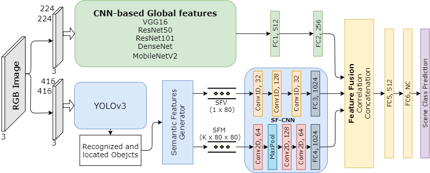
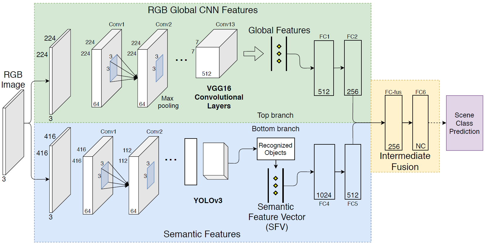

# GSF2App
Implementation of the Global and Semantic Feature Fusion Approach (GSF2App) for Indoor Scene Classification using the PyTorch framework. 

Summary: GSF2App is a two-branches network. In the first branch a state-of-the-art CNN is used to extract global features from the RGB indoor scene image. In the second branch, semantic features based on the YOLOv3's recognized objects, were developed. 

## GSF2AppV2
<p align="center"></p>

## GSF2App(V1)
<p align="center"></p>

  
### Requirements

    Python >= 3.6
    PyTorch >= 1.0.1
    torchvision
    cv2
    tqmd
    

## Citation

```
@InProceedings{GSF2Appv2_2021,
  author={R. {Pereira} and L. {Garrote} and T. {Barros} and A. {Lopes} and U. J. {Nunes}},
  booktitle={IEEE/RSJ International Conference on Intelligent Robots and Systems (IROS)}, 
  title={{A Deep Learning-based Indoor Scene Classification Approach Enhanced with Inter-Object Distance Semantic Features}}, 
  year={2021}}
```

```
@InProceedings{GSF2App_2020,
  author={R. {Pereira} and N. {Gonçalves} and L. {Garrote} and T. {Barros} and A. {Lopes} and U. J. {Nunes}},
  booktitle={IEEE International Conference on Autonomous Robot Systems and Competitions (ICARSC)}, 
  title={{Deep-Learning based Global and Semantic Feature Fusion for Indoor Scene Classification}}, 
  year={2020}}
```

```
@article{yolov3,
	author={Redmon, Joseph and Farhadi, Ali},
	title={{YOLOv3: An Incremental Improvement}},
	journal = {arXiv},
	year={2018}}
```


## Contacts
ricardo.pereira@isr.uc.pt
